# Response Generator Sequence Diagram

This diagram illustrates the complete flow of the Response Generator Agent in the RAG pipeline.

```mermaid
sequenceDiagram
    actor User
    participant API as FastAPI
    participant RGA as ResponseGeneratorAgent
    participant SDB as SessionDBService
    participant QA as QueryAnalyzer
    participant RS as RetreivalService
    participant CM as ContextManager
    participant AOI as AzureOpenAIService
    participant RJ as RelevanceJudge
    participant AC as AuthorizationChecker
    participant RF as ResponseFormatter

    User->>API: POST /chat (query, session_id)
    API->>RGA: generate_response(prompt, container_name, service_line)

    Note over RGA: Step 1: Session Context Retrieval
    RGA->>SDB: retrieve_session_details(user_id, session_id)
    SDB-->>RGA: user_chat_history (last N messages)

    Note over RGA: Step 2: Query Analysis & Classification
    RGA->>QA: query_classifer(prompt, session_context_window)
    QA->>AOI: Analyze query (language, service lines, session dependency)
    AOI-->>QA: Analysis result
    QA-->>RGA: {language, service_lines, is_generic, is_session_dependent, <br/>expanded_queries, is_prompt_vulnerable, acronyms}

    Note over RGA: Step 3: Service Line Authorization
    RGA->>RS: get_all_service_line()
    RS-->>RGA: all_service_line_mappings
    RGA->>RGA: Determine allowed_ids based on user subscriptions
    RGA->>RGA: Map requested service line names to IDs (final_id_list)

    Note over RGA: Step 4: Initial Context Retrieval
    RGA->>RS: rag_retriever_agent(prompt, container_name, final_id_list)
    RS->>AOI: Generate embedding for query
    AOI-->>RS: query_embedding
    RS->>RS: Vector search in CosmosDB with service line filter
    RS-->>RGA: {retrieved_context, top_doc, chunk_service_line, <br/>query_embedding, citations}

    Note over RGA: Step 5: Session Dependency Handling
    alt is_session_dependent
        RGA->>SDB: retrieve_session_entities(user_id, session_id)
        SDB-->>RGA: session_entities {services, topics, technical_terms}

        RGA->>CM: has_references(query)
        CM-->>RGA: true/false

        opt has_references
            RGA->>CM: resolve_references(query, entities, history)
            CM-->>RGA: resolved_query
        end

        RGA->>CM: build_smart_retrieval_query(resolved_query, history, entities)
        CM-->>RGA: retrieval_query (optimized)
    else not session_dependent
        RGA->>RGA: retrieval_query = query + expanded_queries
    end

    Note over RGA: Step 6: Additional Context Retrieval
    RGA->>RGA: get_filtered_context(retrieval_query, container_name, <br/>filtered_context_service_line, query_embedding)
    RGA->>RS: retrieve_general_info_chunks(retrieval_query, ...)
    RS-->>RGA: {chunk_filtered_context, additional_citations}

    Note over RGA: Step 7: Context Deduplication & Preparation
    RGA->>RGA: Combine & deduplicate all retrieved chunks
    RGA->>RGA: Rebuild final_context dictionary by service_id
    RGA->>RGA: Populate context_session with entities & metadata

    Note over RGA: Step 8: Response Generation
    RGA->>RGA: get_response_from_agent(trace_id, prompt, user_chat_history, <br/>final_context, context_session, ...)
    RGA->>AOI: chat.completions.create(messages + enriched_prompt)
    Note over AOI: Enriched prompt includes:<br/>- Current date<br/>- User query<br/>- Retrieved context (2 sources)<br/>- Detected language
    AOI-->>RGA: {Answer, Source, Confidence}

    Note over RGA: Step 9: Response Parsing & Validation
    RGA->>RGA: Parse JSON response or fallback to plain text
    RGA->>RGA: Replace image placeholders & URL corrections

    alt Out of Scope Detected
        RGA->>RGA: Check for "outside the scope" message
        RGA->>RGA: Select random out-of-scope message (language-specific)
    else In Scope
        RGA->>RF: parse_response(Answer)
        RF-->>RGA: formatted_response
    end

    RGA->>RGA: Build structured_response {response, citation, confidence, score}

    Note over RGA: Step 10: Authorization Cross-Check
    RGA->>AC: cross_check_authorization(prompt, user_service_line, <br/>detected_language, is_out_of_scope, <br/>final_response, used_service_lines)

    alt Unauthorized Service Line
        AC-->>RGA: Raise UnAuthorizedServiceLineException
        RGA->>RGA: Update structured_response with error message
    else Partial Access
        AC-->>RGA: Raise PartialAccessServiceLineException(response, disclaimer)
        RGA->>RGA: Add disclaimer to structured_response
    else Out of Scope
        AC-->>RGA: Raise OutOfScopeException
        RGA->>RGA: Update structured_response with friendly message
    else Authorized
        AC-->>RGA: Success (no exception)
    end

    Note over RGA: Step 11: Citation Enhancement
    RGA->>RS: get_ids_from_file_paths(file_list)
    RS-->>RGA: file_id_map {path: id}
    RGA->>RGA: Update citations with id & drivename

    Note over RGA: Step 12: Disclaimer Handling
    opt suppress_disclaimer == false && disclaimer exists
        RGA->>RGA: Append disclaimer message to response
    end

    Note over RGA: Step 13: Session Persistence
    RGA->>RGA: save_session_in_background(user_id, prompt, response, ...)
    RGA->>CM: extract_entities(query, response)
    CM-->>RGA: extracted_entities {services, topics, technical_terms}
    RGA->>CM: get_session_entities_flat(extracted_entities)
    CM-->>RGA: flat_entities
    RGA->>SDB: add_user_assistant_session(user_id, prompt, response, <br/>citation, score, confidence, disclaimer, entities)
    SDB-->>RGA: message_id

    RGA->>RGA: Add message_id to structured_response
    RGA-->>API: structured_response {response, citation, confidence, <br/>score, disclaimer, message_id}
    API-->>User: JSON response
```

## Key Components

### 1. **Session Management**
- Retrieves conversation history for context
- Stores extracted entities for future reference resolution
- Uses last 5 messages for context window

### 2. **Query Analysis**
- Detects language (English, German, French, Spanish)
- Identifies requested service lines
- Determines if query is session-dependent
- Checks for prompt injection vulnerabilities
- Expands queries with synonyms/acronyms

### 3. **Authorization**
- Maps user subscriptions to service line IDs
- Filters retrieval results by authorized service lines
- Performs confidence-based authorization (threshold: 0.80)
- Raises exceptions for unauthorized access

### 4. **Context Retrieval**
- Vector similarity search using Azure OpenAI embeddings
- Dual retrieval strategy:
  - Initial retrieval with user query
  - Additional retrieval with session-aware query
- Returns top chunks ordered by cosine similarity
- Filters out heading-only chunks

### 5. **Session Dependency**
- Resolves references (e.g., "it", "that", "why")
- Builds smart retrieval queries combining current + previous context
- Maintains entity memory (services, topics, technical terms)
- Prevents context loss in follow-up questions

### 6. **Response Generation**
- Enriches prompt with context, date, and language
- Uses Azure OpenAI with temperature=0 for consistency
- Parses structured JSON response: {Answer, Source, Confidence}
- Fallback to plain text if JSON parsing fails

### 7. **Response Validation**
- Checks for out-of-scope responses
- Performs authorization cross-check
- Handles partial access with disclaimers
- Applies language-specific friendly messages

### 8. **Citation Enhancement**
- Retrieves SharePoint file IDs from paths
- Adds drive names for frontend navigation
- Deduplicates citations

## Exception Handling

The pipeline handles three main exception types:

1. **OutOfScopeException**: Query not related to SITA/DigiHub
2. **UnAuthorizedServiceLineException**: User lacks required service line access
3. **PartialAccessServiceLineException**: User has partial access with disclaimer

All exceptions gracefully return structured responses with appropriate messages.

## Performance Optimizations

- Session entity caching for reference resolution
- Smart query merging to reduce retrieval calls
- Context deduplication to minimize token usage
- Background session saving (non-blocking)
- Latency logging for all major operations
